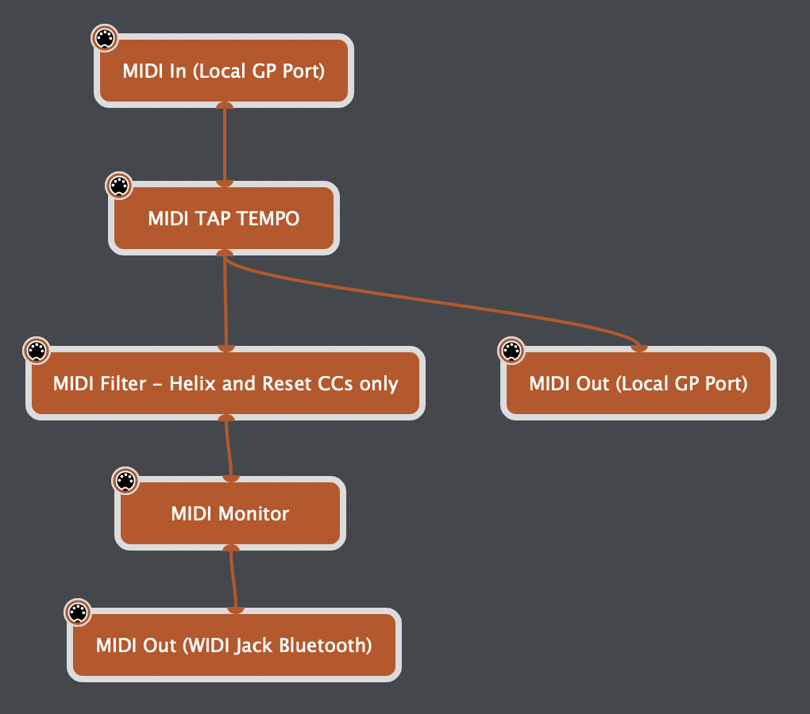
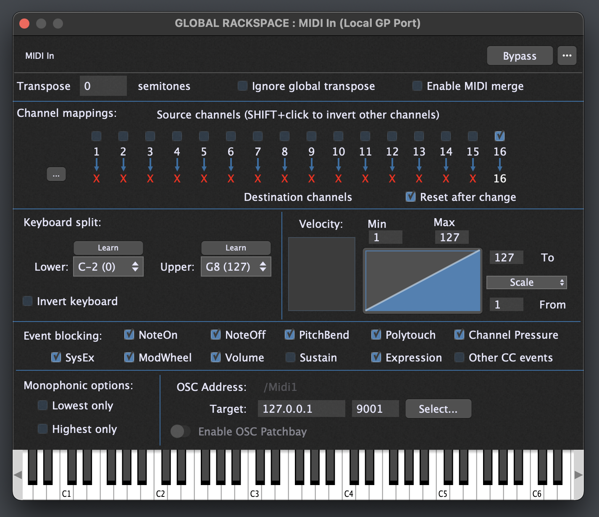
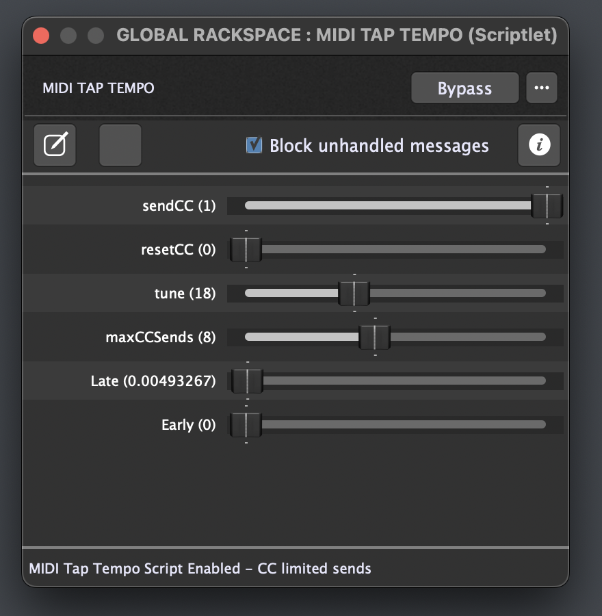
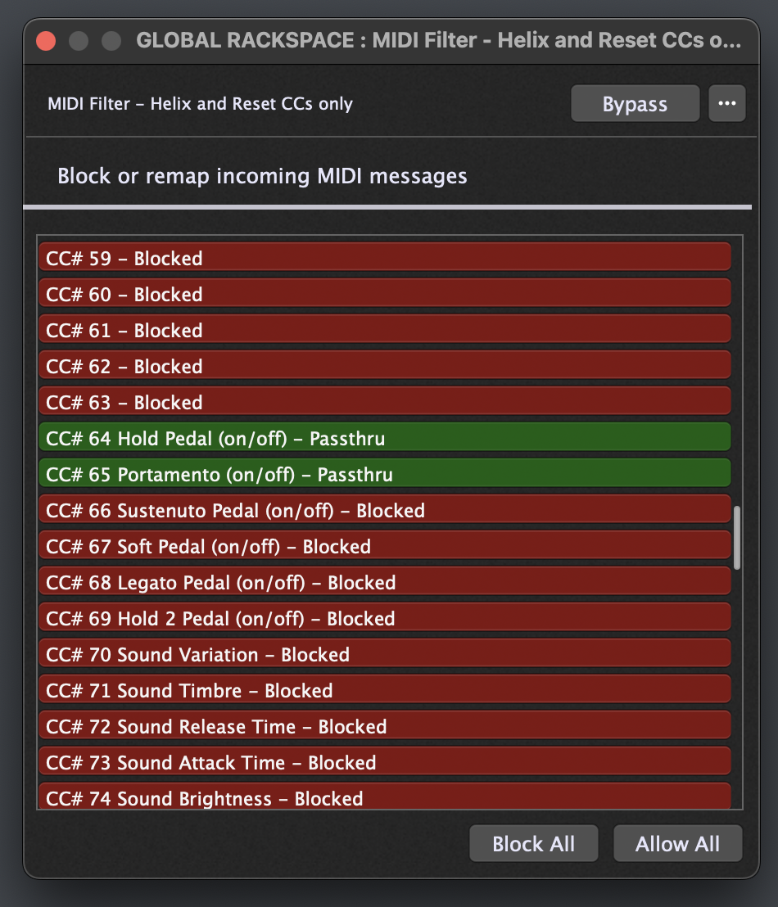
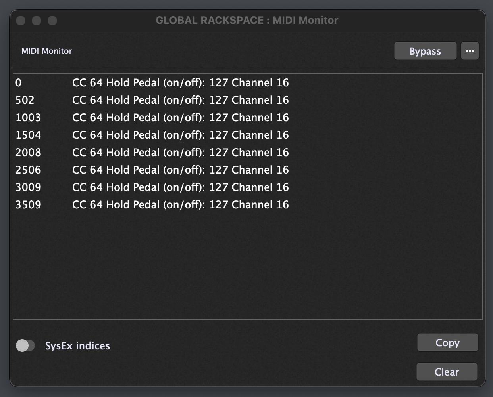
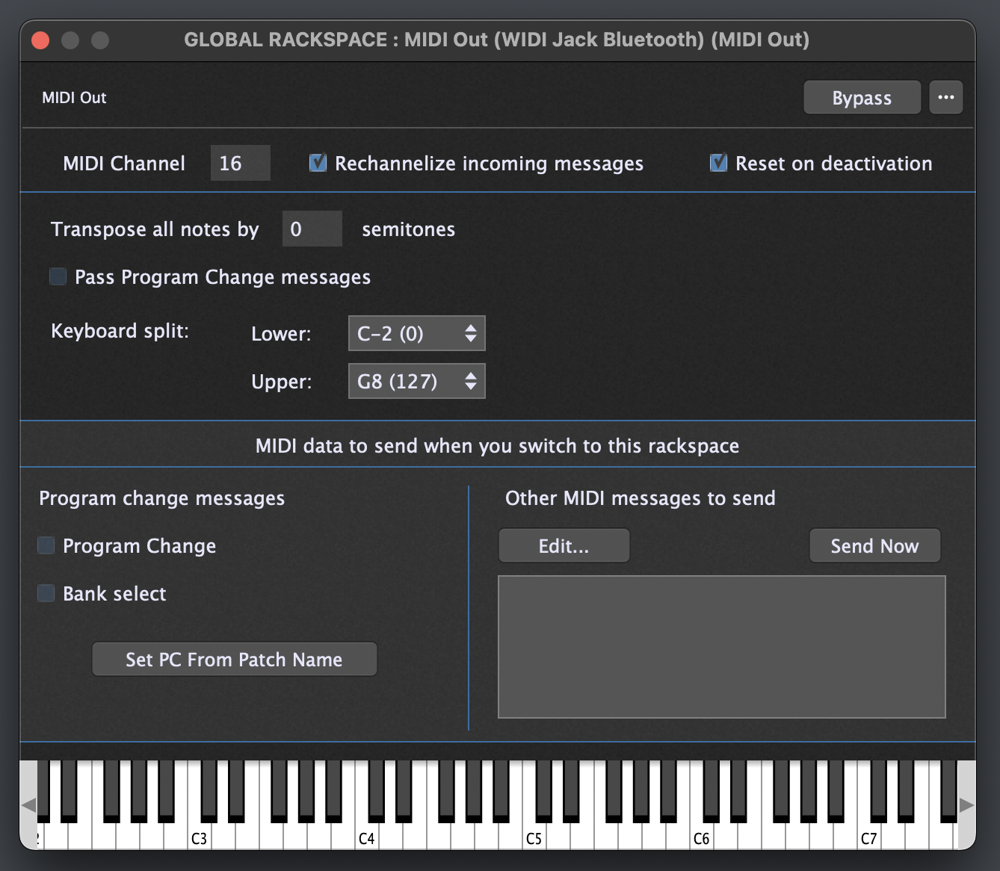
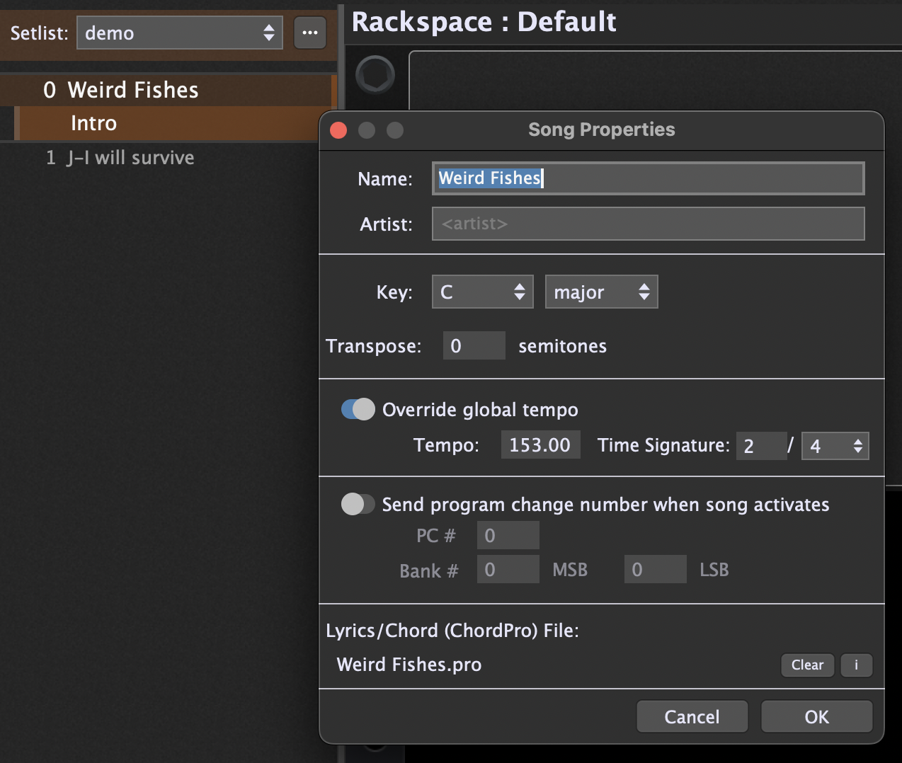
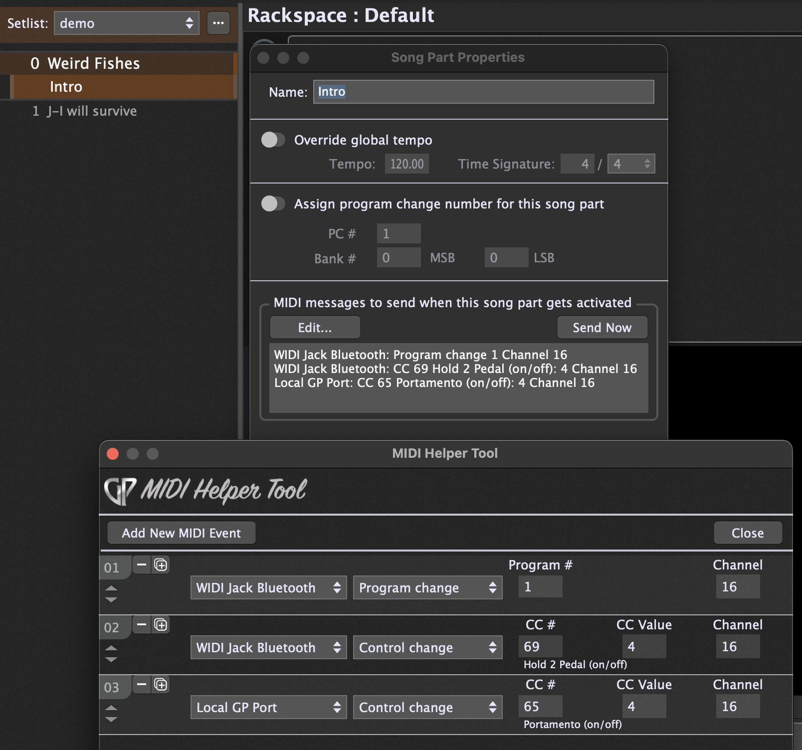

# Gig Performer 5 and Helix Tap Tempo

## Tap Tempo and MIDI clock shenanigans

I attempted to use the gpscript and instructions provided and described by [Spav, here](https://community.gigperformer.com/t/midi-hw-clock-gp-master-scriptlet) to send midi clock information to my Line 6 Helix Floor.

It turns out that the Helix is ~~pretty bad~~ bloody awful at dealing with MIDI clock info - at least as tested via USB MIDI and Bluetooth WIDI (the latter appears to be marginally better). I tried using Link too, but it's pretty bad, even with Tap Tempo Pitch set to Transparent on the Helix.

Spav's script gave me a great starting point, and I ended up _(with the help of a bit of genai)_ sending virtual tap tempo messages on song changes (Helix devices let you do that on CC64). Initially the tap messages were constant, but this cause similar issues to MIDI clock. I managed to change it to send it a limited (configurable) number of times, thereby mimicking doing a manual tap tempo dance after switching between songs.

My Gig file is set up with a setlist of songs. Upon switching to a song, it overrides the global tempo with a configured tempo for the song. I don't use song parts other than for the feature that allows me to send a bunch of MIDI commands. In this way I can:

1. Send a PC message via WIDI to set the relevant Helix preset, then
2. Switch to a particular Helix snapshot via the same WIDI connection.
3. Trigger the gpscript by sending CC65 (arbitrary) via the Local GP MIDI.

The script also has the "tune" feature to tweak it so that the CC taps come through as close as possibly to the desired tempo.

Note: I don't use the f8 hardware clock functionality as this really does not play well with my Helix, plus the Helix does not let you see the tempo it's attempting to set (while the tap LED flashes blue). With the CC method, the Helix tap and scribble strip behaves as if I'm actually hitting the tap tempo myself (flashing red and displaying the tempo while I'm tapping - this allows tweaking with the "tune" variable).

I've modified the script extensively, and while I don't fully understand half of the what it's doing, it appears to work for me and might help someone else in a similar boat.

_**The version I use and is reflected below is: [gp5_helix_taptempo_limited_taps_var.gpscript](gp5_helix_taptempo_limited_taps_var.gpscript)**_

## Screenshots:

- **Global Rackspace Wiring:**
  

- **MIDI In:** _Note that all events apartf from "Sustain" (cc64 - What Helix uses for Tap) and "Other" are blocked_
  

- **MIDI TAP TEMPO Scriptlet:**
  

- **MIDI Filter:** _Only allow CC64 and 65_
  

- **MIDI Monitor:** _8 Events - the default_
  

- **MIDI Out:** _Nothing special apart from setting the channel_
  

- **Setlist - Song Properties:** _Only provide the BPM override_
  

- **Setlist - Song Part Properties:** _Send MIDI messages as configured_
  

- **Visual metronome: TICK** _It's not particularly stable, but I don't know of a better option just yet_
  
