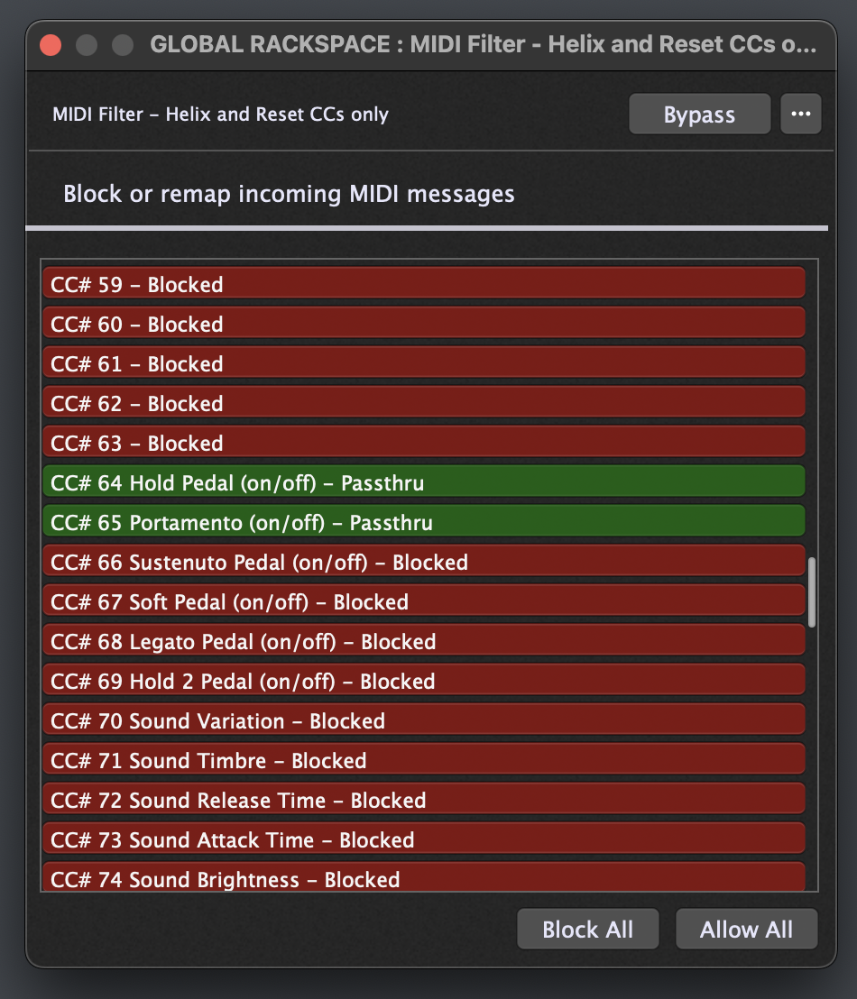
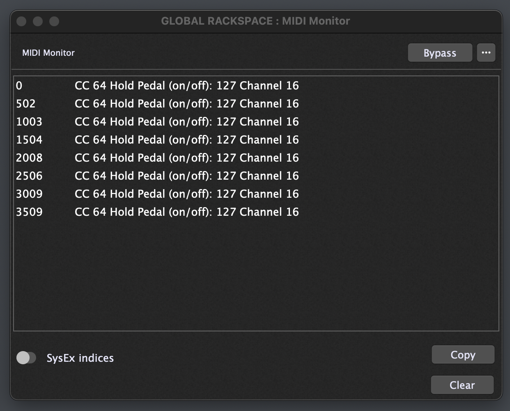
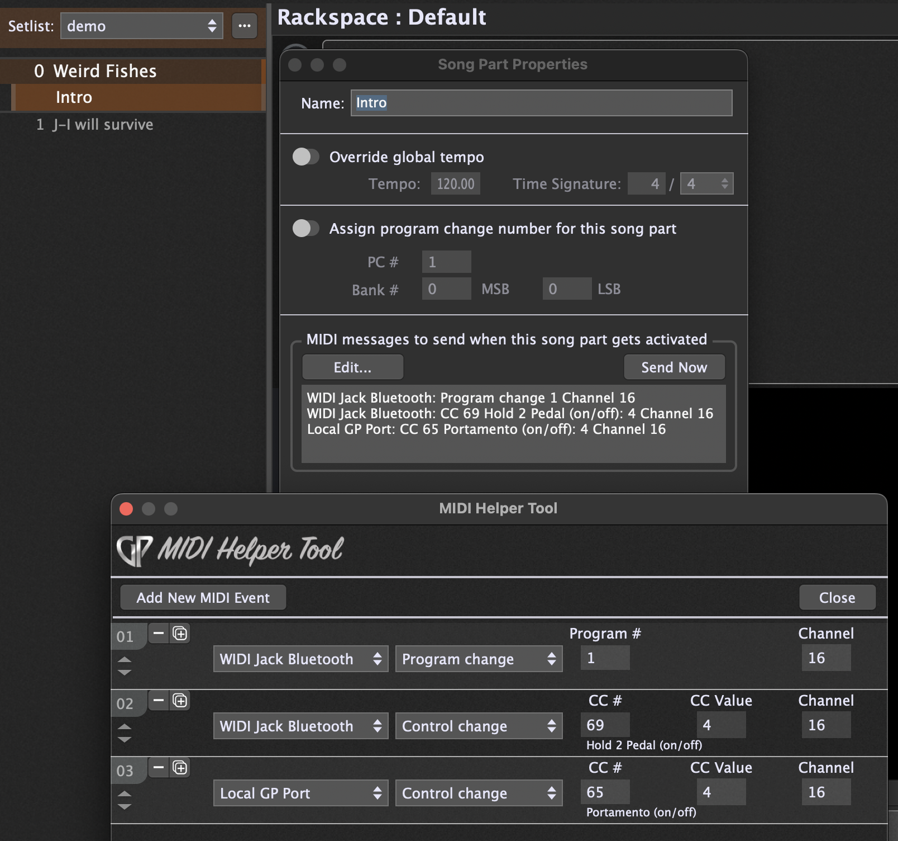

# Gig Performer 5 and Helix Tap Tempo

## Tap Tempo and MIDI clock shenanigans

I attempted to use the gpscript and instructions provided and described by [Spav, here](https://community.gigperformer.com/t/midi-hw-clock-gp-master-scriptlet) to send midi clock information to my Line 6 Helix Floor.

It turns out that the Helix is ~~pretty bad~~ bloody awful at dealing with MIDI clock info - at least as tested via USB MIDI and Bluetooth WIDI (the latter appears to be marginally better). I tried using Link too, but it's pretty bad, even with Tap Tempo Pitch set to Transparent on the Helix.

Spav's script gave me a great starting point, and I ended up _(with the help of a bit of genai)_ sending virtual tap tempo messages on song changes (Helix devices let you do that on CC64). Initially the tap messages were constant, but this cause similar issues to MIDI clock. I managed to change it to send it a limited (configurable) number of times, thereby mimicking doing a manual tap tempo dance after switching between songs.

My Gig file is set up with a setlist of songs. Upon switching to a song, it overrides the global tempo with a configured tempo for the song. I don't use song parts other than for the feature that allows me to send a bunch of MIDI commands. In this way I can:

1. Send a PC message via WIDI to set the relevant Helix preset, then
2. Switch to a particular Helix snapshot via the same WIDI connection.
3. Trigger the gpscript by sending CC65 (arbitrary) via the Local GP MIDI.

The script also has the "tune" feature to tweak it so that the CC taps come through as close as possibly to the desired tempo.

Note: I don't use the f8 hardware clock functionality as this really does not play well with my Helix, plus the Helix does not let you see the tempo it's attempting to set (while the tap LED flashes blue). With the CC method, the Helix tap and scribble strip behaves as if I'm actually hitting the tap tempo myself (flashing red and displaying the tempo while I'm tapping - this allows tweaking with the "tune" variable).

I've modified the script extensively, and while I don't fully understand half of the what it's doing, it appears to work for me and might help someone else in a similar boat.

## Scriptlet

My attempts at modifying the script can be seen in the different versions I keep in my github repo: [huevos-y-bacon/gigperformer/helix-tap-tempo](https://github.com/huevos-y-bacon/gigperformer/tree/main/helix-tap-tempo)

_**The version I use and is reflected below is**_ `gp5_helix_taptempo_limited_taps_var.gpscript`:

```java
// Parameters for CC transmission
var sendCC : Subrange Parameter 0..1 = 1 // 0=disable Clock CC, 1=enable Clock CC (i.e. TAP TEMPO)
var resetCC : Subrange Parameter 0..1 = 0 // 0=normal, 1=reset CC counter and send delayed CC

var tune : Subrange Parameter 0..50 = 18 // Parameter to adjust timing offset (0-50ms early send)
var maxCCSends : Subrange Parameter 2..16 = 8 // Maximum number of CC sends per reset cycle (2-16)
var plus ("Late") : Continuous Parameter = 0.0 // Read-only parameter showing maximum late timing deviation as fraction of beat
var minus ("Early") : Continuous Parameter = 0.0 // Read-only parameter showing maximum early timing deviation as fraction of beat

// Make sure the MIDI IN block does not block CC64 sustain pedal events - Helix tap tempo uses CC64
const MIDI_TAPTEMPO_CC : integer = 64 // MIDI CC number that triggers beat events (Tap Tempo CC)
// Make sure the MIDI IN block does not block CC65 portamento events - MIDI_RESET_CC uses CC65
const MIDI_RESET_CC : integer = 65 // MIDI CC number that triggers CC counter reset (from Local GP MIDI port)
const MIDI_TAPTEMPO_CHN : integer = 16 // MIDI channel for tap tempo messages

// Millisecond intervals
var beat : double = 0.0 // Time duration of one quarter note beat

// Static MIDI messages
var cc : midiMessage // Pre-built Clock CC beat marker message

// Stats
var blast : double = 0.0 // Timestamp of last beat event for timing analysis

// CC send limiting variables
var ccSentCount : integer = 0 // Count of CC messages sent since script start

// Function to calculate and update timing statistics
Function SetStats()
    var now : double = TimeSinceStartup() // Get current time in milliseconds
    var delta : double = 0.0 // Initialize timing deviation variable
    If blast <> 0.0 Then // Only calculate if we have a previous beat time
        delta = (now - blast - beat) / beat // Calculate timing error as fraction of beat
        // If this deviation is more late than previous max
        If plus < delta Then
            plus = delta // Update maximum late deviation
        // If this deviation is more early than previous max
        elsif minus < -delta Then
            minus = -delta // Update maximum early deviation (store as positive)
        End
    End
    
    blast = now // Store current time for next calculation
End

// Function to calculate timing intervals based on current BPM
Function SetIntervals()
    var bps : double = GetBPM()/60 // Convert BPM to beats per second
    beat = (1000/bps) // Calculate milliseconds per beat
End

// Event handler: when sendCC parameter changes, reset stats
On ParameterValueChanged matching sendCC
    SetIntervals() // Recalculate intervals with current BPM
    blast = 0.0 // Reset timing statistics
    plus = 0.0 // Reset late timing statistic
    minus = 0.0 // Reset early timing statistic
End

// Event handler: when tune parameter changes, recalculate timing
On ParameterValueChanged matching tune
    SetIntervals() // Recalculate intervals with current BPM
End

// Event handler: when maxCCSends parameter changes
On ParameterValueChanged matching maxCCSends
    // No specific action needed, parameter is used directly in comparisons
End

// Event handler: when Tap Tempo CC is received on channel 16, generate CC response
On ControlChangeEvent(m : ControlChangeMessage) Matching MIDI_TAPTEMPO_CC
    // Only respond to messages on channel 16
    If GetChannel(m) == MIDI_TAPTEMPO_CHN Then
        // Send CC message only if sendCC is enabled AND we haven't exceeded the limit
        If sendCC >= 1 And ccSentCount < maxCCSends Then
            SendLater(cc,beat-tune) // Send Tap Tempo CC back out, advanced by 'tune' milliseconds
            ccSentCount = ccSentCount + 1 // Increment the counter
        End
        
        SetIntervals() // Recalculate intervals in case BPM changed
        SetStats() // Update timing statistics (always calculate for monitoring)
    End
End

// Event handler: when Reset CC is received, reset CC counter and send delayed CC
On ControlChangeEvent(m : ControlChangeMessage) Matching MIDI_RESET_CC
    // Only respond to messages on channel 16
    If GetChannel(m) == MIDI_TAPTEMPO_CHN Then
        ccSentCount = 0 // Reset CC send counter for new song
        SetIntervals() // Recalculate intervals for new song
        blast = 0.0 // Reset timing statistics
        plus = 0.0 // Reset late timing statistic
        minus = 0.0 // Reset early timing statistic

        // Send initial CC after 300ms delay if sendCC is enabled
        If sendCC >= 1 Then
            SendLater(cc, 300) // Send initial Tap Tempo CC after 300ms delay
            ccSentCount = ccSentCount + 1 // Count this as the first send
        End
        SetDisplayMessage("CC counter reset via MIDI CC65")
    End
End

// Event handler: when resetCC parameter changes, reset counter and send delayed CC
On ParameterValueChanged matching resetCC
    If resetCC >= 1 Then
        ccSentCount = 0 // Reset CC send counter for new song
        SetIntervals() // Recalculate intervals for new song
        blast = 0.0 // Reset timing statistics
        plus = 0.0 // Reset late timing statistic
        minus = 0.0 // Reset early timing statistic

        // Send initial CC after 300ms delay if sendCC is enabled
        If sendCC >= 1 Then
            SendLater(cc, 300) // Send initial Tap Tempo CC after 300ms delay
            ccSentCount = ccSentCount + 1 // Count this as the first send
        End
        SetDisplayMessage("CC counter reset - new song ready")
        
        resetCC = 0 // Auto-reset the parameter back to 0
    End
End

// Called automatically after script is loaded
Initialization
    // Create Tap Tempo CC, value 127, channel 16
    cc = MakeControlChangeMessageEx(MIDI_TAPTEMPO_CC,127,MIDI_TAPTEMPO_CHN)
    
    SetIntervals() // Calculate initial timing intervals
    ccSentCount = 0 // Initialize CC send counter

    // Send initial CC after 300ms delay if sendCC is enabled
    If sendCC >= 1 Then
        SendLater(cc, 300) // Send initial Tap Tempo CC after 300ms delay
        ccSentCount = ccSentCount + 1 // Count this as the first send
    End

    blast = 0.0 // Reset last beat timestamp
    plus = 0.0 // Reset late timing statistic
    minus = 0.0 // Reset early timing statistic
    SetDisplayMessage("MIDI Tap Tempo Script Enabled - CC limited sends")
End
```

## Screenshots:

- **Global Rackspace Wiring:**
  

- **MIDI In:** _Note that all events apartf from "Sustain" (cc64 - What Helix uses for Tap) and "Other" are blocked_
  

- **MIDI TAP TEMPO Scriptlet:**
  

- **MIDI Filter:** _Only allow CC64 and 65_
  

- **MIDI Monitor:** _8 Events - the default_
  

- **MIDI Out:** _Nothing special apart from setting the channel_
  

- **Setlist - Song Properties:** _Only provide the BPM override_
  

- **Setlist - Song Part Properties:** _Send MIDI messages as configured_
  

- **Visual metronome: TICK** _It's not particularly stable, but I don't know of a better option just yet_
  
